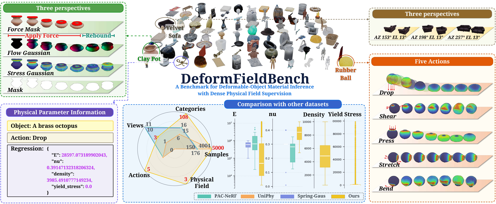

# DeformFieldBench



## Data and Checkpoints

- Dataset: [Physical Field Material Parameter 5000 on Kaggle](https://www.kaggle.com/datasets/anonymous336/physical-field-material-parameter-5000)
- Checkpoints: [HandsomeHusky/DeformFieldBench on Hugging Face](https://huggingface.co/HandsomeHusky/DeformFieldBench/tree/main)

Download checkpoints:

```bash
bash pretrained/download_models.sh
```

Training and evaluation expect the following default layout:

```text
auto_output/dataset_5000/train/<sample_id>/sample_pack.npz
auto_output/dataset_5000/train_test_split.cleaned.json
pretrained/logic_baseline_epoch_0320.pt
pretrained/supervised_baseline_last.pt
pretrained/logic_abl_no_boundary.pt
pretrained/logic_abl_no_field_aux.pt
pretrained/logic_abl_no_multistage.pt
pretrained/logic_plus_phys_01.pt
```

`sample_pack.npz` is the unified data interface. Each sample contains three-view RGB deformation videos, force masks, projected flow fields, stress fields, object masks, and the four final material parameters used in the paper: Young's modulus `E`, Poisson's ratio `nu`, density `rho`, and yield stress `sigma_y`.

## Environment

Python 3.10 is recommended. The internal training environment is `envs/train`, with the following core versions: `Python 3.10.20`, `torch 2.8.0+metax3.5.3.9`, `numpy 1.26.4`, and `opencv-python 4.9.0.80`. For CUDA GPUs, install a PyTorch build compatible with your local CUDA runtime. For MACA/Metax machines, configure the cu-bridge runtime.

```bash
pip install -r requirements.txt
source scripts/setup_env.sh
```

On the internal platform, you can activate the prepared environment directly:

```bash
source scripts/activate_train_env.sh
```

`requirements.txt` covers simulation and data I/O dependencies, including `taichi==1.5.0`, `warp_lang==0.10.1`, `scipy==1.15.2`, `Pillow`, `pymeshlab`, and `PyMCubes`. VLM benchmarks additionally require:

```bash
pip install -r requirements-vlm.txt
export DASHSCOPE_API_KEY=your_key
export OPENAI_API_KEY=your_key
export ARK_API_KEY=your_key
```

## Simulation and Config

Generate a single sample in the same format as the final dataset:

```bash
PLY_PATH=/path/to/object.ply \
SIM_TYPE=press \
CONFIG=configs/simulation/train_config_dataset_full.json \
OUTPUT_PATH=outputs/simulation_sample \
bash scripts/run_simulation_sample_pack.sh
```

`SIM_TYPE` can be `press`, `drop`, `shear`, `stretch`, or `bend`. The output directory will contain `sample_pack.npz` and `meta/` files with GT parameters, boundary conditions, force information, and run parameters. The model's final global material outputs are only `E`, `nu`, `rho`, and `sigma_y`; action labels, boundary conditions, external forces, and gravity are simulation/replay metadata, not final parameter outputs.

For the final dataset format, the important config fields are:

- `seed`, `num_simulations`, `sim_types`: control the number of generated jobs, random seed, and action type set.
- `output_root`, `dataset_name`, `dataset_split`: control the dataset path. The named dataset layout is `auto_output/<dataset_name>/<dataset_split>/<sample_id>/`.
- `base_config_by_sim_type`: maps each action type to its base simulation template, for example `press` to `simulation/config/press_cube_jelly.json`.
- `num_views`, `num_render_views`, `random_render_views`: control multi-view rendering and random view sampling.
- `render_outputs_per_sim_second`, `num_render_timesteps`: control temporal sampling. `render_outputs_per_sim_second` takes priority when it is greater than zero.
- `render_export_max_side`, `render_export_scale`, `camera_distance_scale`: control export resolution and camera distance.
- `render_img`, `output_view_stress_gaussian`, `output_view_flow_gaussian`, `output_view_force_mask`, `output_view_object_mask`: control the RGB, stress, flow, force-mask, and object-mask arrays required by the final sample pack.
- `stress_gaussian_single_channel`, `force_mask_single_channel`: use single-channel field and mask outputs consistent with the training input convention.
- `pack_sample_pack`, `pack_sample_pack_include_object_mask`, `sample_pack_name`: must be enabled to write `sample_pack.npz`.
- `output_bc_info`, `output_force_info`, `output_initial_force_mask_arrow`: write boundary and force metadata reused by parameter ambiguity replay.

## Arch4 Training

Arch4 is the supervised parameter-regression baseline. The entry point is `my_model.train`, and the default config is `configs/my_model/train_dataset_5000_param_only.json`. This config reads `auto_output/dataset_5000/train` and `train_test_split.cleaned.json`, uses 3 views, 64 frames, and 224 resolution, disables field supervision, and only regresses the final material parameters `E`, `nu`, `rho`, and `sigma_y`.

```bash
NUM_GPUS=8 bash scripts/train_my_model_param_only.sh
```

To train Arch4 with field supervision, do not use `train_my_model_param_only.sh`, because that script always passes `--disable_aux_losses`. Instead, copy the config and enable the auxiliary field heads and field losses:

```bash
cp configs/my_model/train_dataset_5000_param_only.json \
  configs/my_model/train_dataset_5000_with_fields.json
```

Set the following fields in the new config:

```json
{
  "model": {
    "use_aux_field_heads": true,
    "dec_h": 112,
    "dec_w": 112
  },
  "train": {
    "disable_aux_losses": false,
    "lambda_stress": 1.0,
    "lambda_flow": 1.0,
    "lambda_force": 1.0,
    "checkpoint": {
      "save_dir": "output_checkpoints/my_model_dataset_5000_with_fields"
    }
  }
}
```

Then launch training directly:

```bash
source scripts/setup_env.sh
NUM_GPUS=8
python -m torch.distributed.run --nproc_per_node="$NUM_GPUS" -m my_model.train \
  --config configs/my_model/train_dataset_5000_with_fields.json
```

The total loss is the parameter regression loss plus three auxiliary field reconstruction losses for stress, flow, and force. The final parameter outputs remain `E`, `nu`, `rho`, and `sigma_y`; field supervision is only used as an auxiliary training signal.

Key training settings:

- `train.epochs=400`, `batch_size=1`, `lr=3e-4`.
- The default checkpoint is saved to `output_checkpoints/my_model_dataset_5000_param_only/last.pt`.

## Logic Model Training and Ablation

The final model entry point is `logic_model.train`, with config `configs/logic_model/final_logic_413_5000_new.json`. The model uses `logic_v2_dino`, reads `sample_pack.npz`, predicts dense physical fields from three-view RGB deformation videos, and regresses the final material parameters `E`, `nu`, `rho`, and `sigma_y`.

```bash
NUM_GPUS=8 bash scripts/train_logic.sh
```

Final model config:

- `arch=logic_v2_dino`: uses a frozen DINOv2 frame encoder.
- `num_views=3`, `num_frames=64`, `img_size=224`: matches the final dataset input.
- `temporal_adapter_type=transformer`: models temporal deformation cues for each view.
- `fusion_dim=512`, `fusion_heads=8`: fuses multi-view representations.
- `field_head_mode=shared_temporal`: uses a shared dense-field decoder.
- `field_use_patch_tokens=true`, `field_use_multiscale_spatial=true`: uses DINO patch tokens and multi-scale RGB conditions for local field prediction.
- `field_use_shared_task_phys=true`, `field_use_geometry_residual=true`, `field_sequential_stress=true`: correspond to the physics bottleneck, geometry residual, and sequential stress refinement in the paper.
- The final parameter head predicts `[log(1+E), nu, log(1+rho), log(1+sigma_y)]`; large-range physical quantities are trained in log space.

Key training settings:

- `train.epochs=320`, `batch_size=1`, `lr=1e-5`, `use_amp=true`.
- `lambda_stress=1`, `lambda_flow=1`, `lambda_force=2` control auxiliary field supervision.
- `stage_flow_force_epochs=100`, `stage_stress_epochs=80`, `stage_joint_epochs=100` control the multi-stage training schedule.
- `lambda_stress_edge=0.05`, `lambda_flow_edge=0.2` control boundary-enhanced losses.
- `use_phys_loss=false`, `lambda_phys=0.0` are the default final-model settings.

For ablation experiments, copy the final config to a new JSON file and only modify the ablation-specific fields. Keep the data, model, and other training settings unchanged:

```bash
cp configs/logic_model/final_logic_413_5000_new.json \
  configs/logic_model/logic_abl_no_field_aux.json
# Edit configs/logic_model/logic_abl_no_field_aux.json using the rules below.
CONFIG=configs/logic_model/logic_abl_no_field_aux.json \
NUM_GPUS=8 \
bash scripts/train_logic_ablation.sh
```

Ablation rules:

- `logic_abl_no_field_aux`: set `lambda_stress/lambda_flow/lambda_force` to `0` to remove auxiliary field supervision.
- `logic_abl_no_multistage`: set all stage epoch counts to `0` to remove the multi-stage schedule.
- `logic_abl_no_boundary`: set `lambda_stress_edge/lambda_flow_edge` to `0` to remove boundary enhancement.
- `logic_plus_phys_0001/001/01`: set `use_phys_loss=true` and `lambda_phys` to `0.001/0.01/0.1`; the released checkpoints include `logic_plus_phys_01`.

## Unified Evaluation and Metrics

All models use the same evaluation entry point, `scripts/eval_param_metrics.sh`. `MODEL=my_model` calls `eval_abalation.eval_my_model`, and `MODEL=logic` calls `eval_abalation.eval_logic`.

```bash
MODEL=logic \
CHECKPOINT=pretrained/logic_baseline_epoch_0320.pt \
OUT_DIR=outputs/param_eval/logic \
bash scripts/eval_param_metrics.sh
```

```bash
MODEL=my_model \
WEIGHTS=pretrained/supervised_baseline_last.pt \
OUT_DIR=outputs/param_eval/my_model \
bash scripts/eval_param_metrics.sh
```

Common arguments:

- `EVAL_SPLIT=test`: evaluation split.
- `NUM_SAMPLES=0`: evaluate all samples; values greater than 0 enable sampling.
- `OUT_DIR`: output directory.

Outputs include `summary.json`, `score.json`, `param_metrics/`, and `field_metrics/`. `param_metrics` only reports the final material parameters used in the paper: `E`, `nu`, `rho`, and `sigma_y`. Metrics include `MAE`, `RMSE`, `MAPE`, `median AE`, `P90 AE`, `bias`, `Pearson/Spearman`, `R2`, calibration slope/intercept, and range-normalized composite error. Field metrics correspond to stress, motion flow, and contact/force regions in the paper, including `MSE`, `SSIM`, region IoU/recall, flow coverage/velocity/EPE/motion quality, force main recall/centroid distance/area error, and stress hotspot recall/weighted MAE/rank correlation.

## Parameter Ambiguity Replay

This evaluation first predicts material parameters, writes the predicted parameters back into the simulation config, replays each sample with `modified_simulation.py`, and compares replayed RGB against GT RGB using `SSIM` and `PSNR`. It directly reuses `param_metrics/sample_records.jsonl` exported by parameter evaluation.

```bash
DATASET_ROOT=auto_output/dataset_5000/train \
RECORDS=outputs/param_eval/logic/param_metrics/sample_records.jsonl \
OUT_DIR=outputs/param_ambiguity/logic \
REPLAY_NUM_SAMPLES=0 \
REPLAY_NUM_GPUS=1 \
bash scripts/eval_param_ambiguity.sh
```

Outputs:

```text
outputs/param_ambiguity/logic/replay_selection.json
outputs/param_ambiguity/logic/replay_metrics.jsonl
outputs/param_ambiguity/logic/replay_metrics.csv
outputs/param_ambiguity/logic/replay_summary.json
outputs/param_ambiguity/logic/replay_samples/<sample_id>/
```

`REPLAY_NUM_SAMPLES=0` replays all records. `REPLAY_SAMPLE_MODE=random` enables random sampling, and `REPLAY_SEED` controls randomness.

## Repository Layout

```text
configs/          Training, simulation, and evaluation configs
simulation/       Sample-pack simulation code
my_model/         Arch4 supervised parameter-regression baseline
logic_model/      Logic Model and training code
eval_abalation/   Parameter, field, and ambiguity evaluation
vlm_benchmark/    VLM benchmark entry points
scripts/          Reproducible command-line entry points
pretrained/       Checkpoint manifest and download script
outputs/          Default local output directory
```

